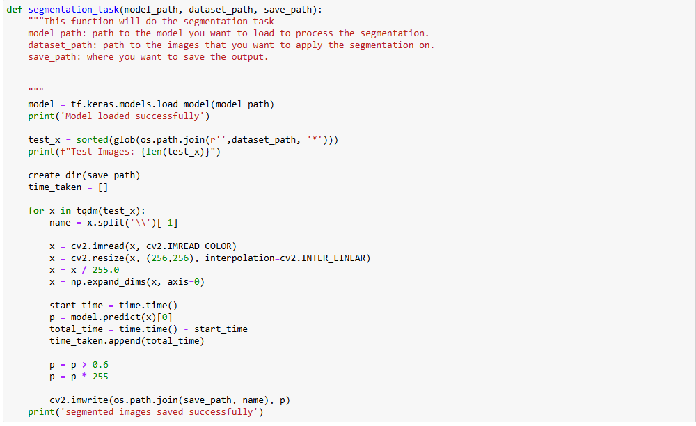
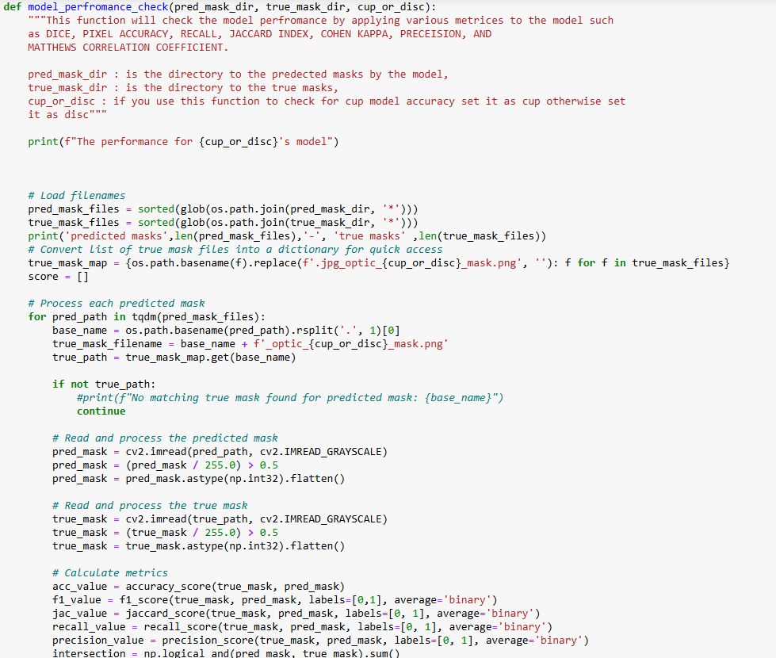
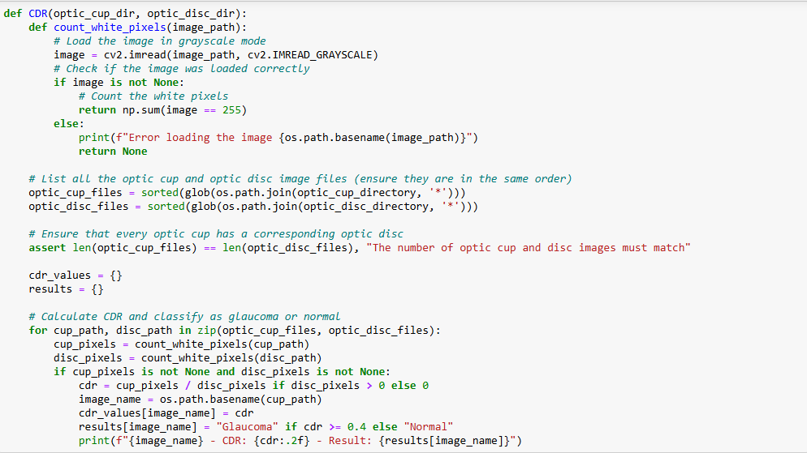
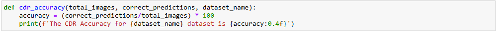

# Glaucoma-classification-model

Glaucoma classification model is the model project for our proposed paper that will be published soon. Now this repo will have the weights only, after the paper is published the code for the model, how to train, and more will be added.

**NOTE: DO NOT FORGET TO UNZIP THE FOLDERS**

## Folder structure

The repository is structured as follows:

1. Dataset folder: This folder contains the datasets used to train, test, and validate the models. Datasets are ACRIMA, DRISHTI-GS, and RIM-ONE.

2. files folder: This folder contains the weights of the models. **NOTE** Because of weight size, the file is available in Google Docs using this [link](https://drive.google.com/drive/folders/1EjKJgV9oEtuPHs7siJ7ogsBPn-_YG8kc?usp=drive_link)

3. predictions folder: In this folder the models performance was test on the test images from the datasets folder each model for its own dataset. the predictions are saved as masks for cup and disc.

4. cdr folder: Its the folder that contains the test images from different datasets (ACRIMA, DRISHTI-GS, RIM-ONE) to test the CDR accuracy of all the models **note** the models were not trained on these images.

5. classification_model: This folder contains the weights for the classification model that is used to classify images as (optic-cup, no optic-cup). **NOTE** Because of weight size the file is available in Google Docs using this [link](https://drive.google.com/drive/folders/1EjKJgV9oEtuPHs7siJ7ogsBPn-_YG8kc?usp=drive_link)

6. classified_images: This folder has 3 folders inside it, each one for each dataset. In each folder, there are two folders named (cdr and segmentation). The cdr folder contains the output of the classification model applied to each dataset. The segmentation folder contains the output of the segmentation model applied to the cdr folder images **NOTE** that cdr here is not the same folder in the first step.

7. models.ipynb: This is the code used to test all the models. You can clone it and run it on your end.

## Getting Started

### Prerequisites

In order to clone and use this repo, you need to have the following:

- Python (version >= 3.7)
- Tensorflow (version >= 2.10.0)
- Numpy
- OpenCv
- Matplotlib.pyplot
- glob
- tqdm
- shutil

**NOTE:** the models' file used in jupyter notebook its preferred to use anaconda but it's okay to use only jupyter notebook

## Installation

To Install and run the test on your end you need to clone the repo using this snippet :

### Clone this repository

```shell
git clone https://github.com/Alzubair98/Glaucoma-classification-model.git
```

### Run Anaconda

```shell
jupyter notebook
```

and navigate to Glaucoma-classification-model folder, open models.ipynb

## Explination of the Code In Models.ipynb

Most Important functions will be explained here.

<div align='center'>

</div>

The segmentation task is function is used to load a model, load dataset, and predict the masks of the dataset images using the model then save the results (masks) in a save_path. The parameters of this function are:

1- model_path : path to the model.

2- dataset_path : path to the dataset.

3- save_path : path to where you want to save the images.

<div align='center'>

</div>

The second function is Model_performance_check its used to check measure the model performance using various matrices such as (DICE, PIXEL ACCURACY, RECALL , JACCARD INDEX, COHEN KAPPA, and MORE). The parameters of this function are:

1- pred_mask_dir : the path to the predicted masks.
2- true_mask_dir : the path to the ture masks/labels.
3- cup_or_disc : in case you measure the accuracy of a disc masks you need to write disc otherwise you need to write cup.

<div align='center'>

</div>

The Third function is used to classifiy images as optic-cup and no optic-cup (no Glaucoma) this function will autumatically load the weights from the classfication model path and apply the classification on the images and save the output on another file. the parameters of this function are:

1- images_path : images you want to apply the model on.

2- output_path : the path were you want to save the classified images in.

**NOTR:** the output will be saved in two folders first one called optic-cup for images classified as there is an optic cup, and no-glaucoma for images classified as no optic-cup. as mentioned in the paper the optic-cup images will be processed to the segmentation task to apply the CDR on it and find if its normal or glaucoma affected.

<div align='center'>

</div>

The fourth function is Cup-to-Disc Ration (CDR), which measures whether the image is a normal or glaucoma-affected eye. the CDR measurement is the total pixels of optic cup divided by total pixels of optic disc:

$$
 \text{CDR} = \frac{\text{Total number of pixels of the optic cup}}{\text{Total number of pixels of the optic disc}}
$$

the parameters of the function are:

1- optic-cup-dir : path to the predicted optic cup masks.

2- optic-disc-dir : path to the predicted optic disc masks.

The function will output:

Images names - Result of CDR - Reuslt (glaucoma or normal).

<div align='center'>

</div>

The final function is used to check the overall accuracy of CDR , because we have applyed the CDR on more than one image we need to measure the overall accuracy and its measured using this equation:

$$
 \text{CDR-Accuracy} = \frac{\text{correct prediction}}{\text{total number of images}} * 100\%
$$

the parameters of this function are:

1- total_images : total number of images.

2- correct_predictions : number of correct predictions.

3- dataset_name : the name of the dataset you are checking the accuracy on.

## Important

Rest of the code is applying the functions above on the propsed model and find the accuracies of them

## Models Performance

The proposed model performance is shown in the Table below:

**DISC**

| DataSet    | Dice    | Jaccard Index | Recall  | Precision | Pixel Accuracy | Cohen's Kappa | MCC     |
| ---------- | ------- | ------------- | ------- | --------- | -------------- | ------------- | ------- |
| Dristhi-Gs | 0.97292 | 0.94755       | 0.96919 | 0.97744   | 0.97379        | 0.94654       | 0.94724 |
| ACRIMA     | 0.95450 | 0.91378       | 0.95393 | 0.95761   | 0.97917        | 0.94074       | 0.94178 |
| RIM-ONE    | 0.96716 | 0.93687       | 0.95852 | 0.97720   | 0.97410        | 0.94563       | 0.94653 |

**CUP**

| DataSet    | Dice    | Jaccard Index | Recall  | Precision | Pixel Accuracy | Cohen's Kappa | MCC     |
| ---------- | ------- | ------------- | ------- | --------- | -------------- | ------------- | ------- |
| Dristhi-Gs | 0.94174 | 0.89081       | 0.93683 | 0.95046   | 0.97094        | 0.92160       | 0.92329 |
| ACRIMA     | 0.90040 | 0.82127       | 0.90038 | 0.91134   | 0.98140        | 0.89008       | 0.89335 |
| RIM-ONE    | 0.90076 | 0.82247       | 0.92093 | 0.89251   | 0.98066        | 0.88979       | 0.89330 |

**CDR classification Accuracy**

| DataSet    | CDR Accuracy |
| ---------- | ------------ |
| Dristhi-Gs | 94.4444 %    |
| ACRIMA     | 96.4286 %    |
| RIM-ONE    | 93.2836 %    |


## If you use this code please cite this work 

Alzubair Alqaraghuli. (2024). Alzubair98/Glaucoma-classification-model: First Release of the model (Test-model). Zenodo. https://doi.org/10.5281/zenodo.12737514
